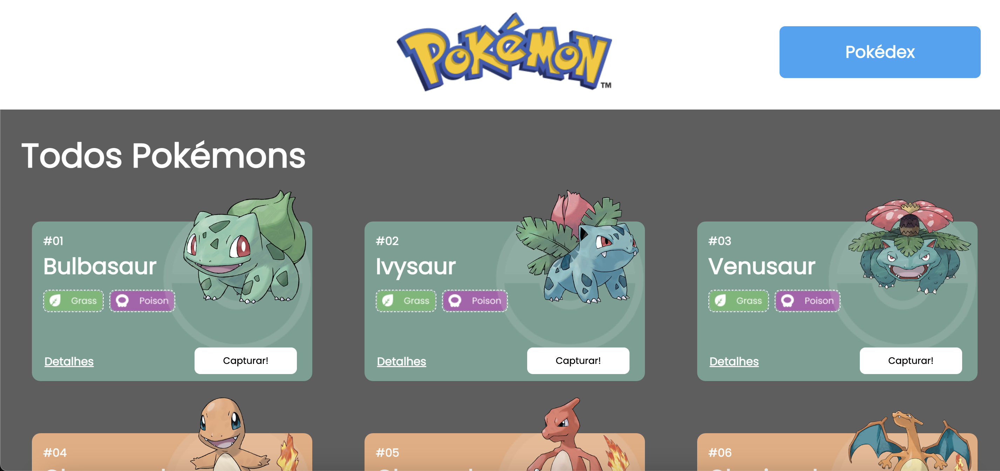
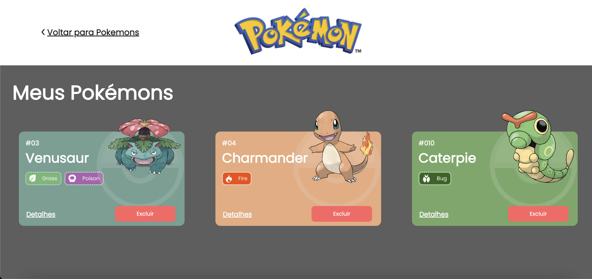
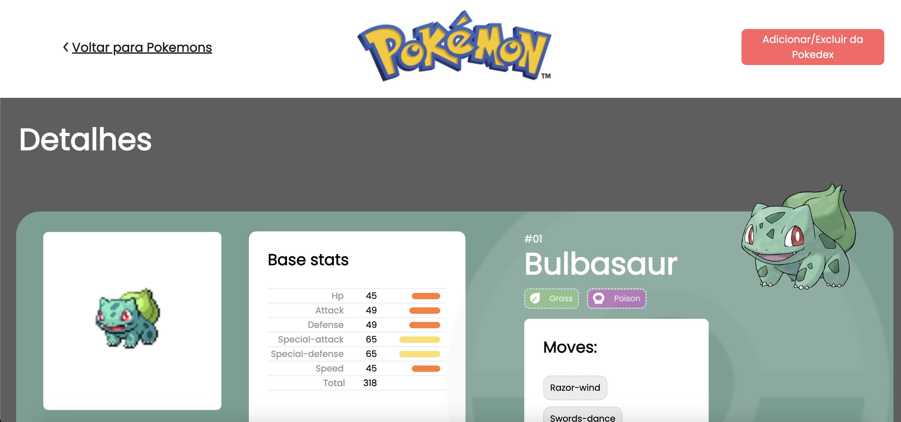

# **Projeto Pokédex**

O Projeto Pokédex é um site de pokémons que possui três páginas: Home, Pokedex e Detalhes. O projeto terá como fonte de dados a [Poke Api](https://pokeapi.co/ "Poke Api"), uma API pública de Pokémons. Esse projeto foi desenvolvido como parte do bootcamp Labenu.

## 🔍 **Índice**
- <a href="#funcionalidades">Funcionalidades do projeto</a>
- <a href="#layout">Layout</a>
- <a href="#demonstracao">Demonstração</a>
- <a href="#rodar">Como rodar esse projeto?</a>
- <a href="#tecnologias">Tecnologias utilizadas</a>
- <a href="#autoras">Pessoas autoras</a>

## 💻 **Funcionalidades do projeto**
- [x] Lista na página inicial com 21 Pokémons
- [x] Página com detalhes dos Pokémons
- [x] Botões de remover/adicionar o Pokémon à Pokédex
- [x] Pokédex com lista de Pokémons adicionados

## 🖼 **Layout**




## 🎯 **Demonstração**
[Link demonstração](https://pokedex-constance03.surge.sh)

## 🕹 **Como rodar esse projeto?**

```
# Clone esse repositório
$ git clone link-repositorio

# Acesse a pasta do projeto no seu terminal
$ cd projeto-pokedex

# Instale as dependências
$ npm install 

# Execute a aplicação
$ npm run dev

```

## ⚙️ **Tecnologias utilizadas**

1. [React](https://pt-br.reactjs.org/)
2. [React Router](https://reactrouter.com/)
3. [Styled-components](https://styled-components.com/)
4. [Axios](https://axios-http.com/)


## 👩🏻‍💻 **Pessoas autoras**


[Linkedin](https://www.linkedin.com/in/mariaconstance/)

